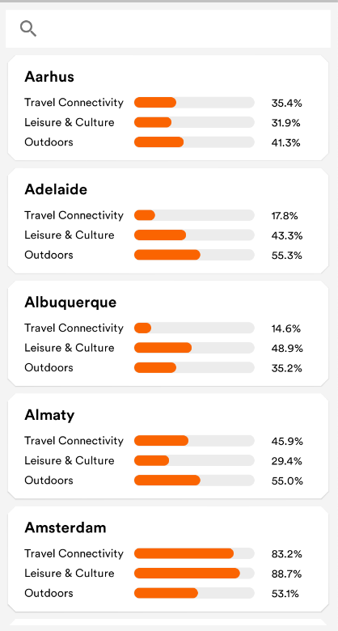
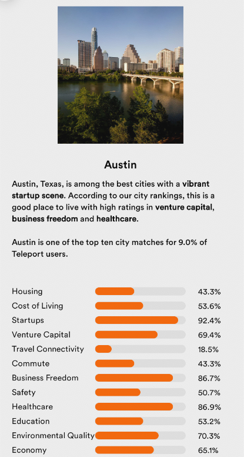

# TravelAdvisor

This project contain :
* MVVM with clean architecture implementation base on [Android architecture Guide](https://developer.android.com/jetpack/docs/guide) and [Uncle Bob clean Architecture](https://blog.cleancoder.com/uncle-bob/2012/08/13/the-clean-architecture.html) 
* Material design base on [Material Design Doc](https://material.io/develop/android/theming/theming-overview)
* Travel data from [Teleport public APIs](https://developers.teleport.org/api/)

Used Libs
---------------
* [Material](https://material.io/develop/android/docs/getting-started/)
* [ViewBinding](https://developer.android.com/topic/libraries/view-binding/)
* [Coil](https://github.com/coil-kt/coil) 
* [ViewModel](https://developer.android.com/topic/libraries/architecture/viewmodel)
* [LiveData](https://developer.android.com/jetpack/arch/livedata)
* [StateFlow](https://kotlin.github.io/kotlinx.coroutines/kotlinx-coroutines-core/kotlinx.coroutines.flow/-state-flow/)
* [Coroutines](https://github.com/Kotlin/kotlinx.coroutines#user-content-android)
* [Flows](https://kotlin.github.io/kotlinx.coroutines/kotlinx-coroutines-core/kotlinx.coroutines.flow/-flow/)
* [Dagger](https://dagger.dev/) 
* [Moshi](https://github.com/square/moshi) 
* [Retrofit2](https://square.github.io/retrofit/) 

Screenshots
---------------
# Screenshots

To be Added
---------------
*More Testing 
